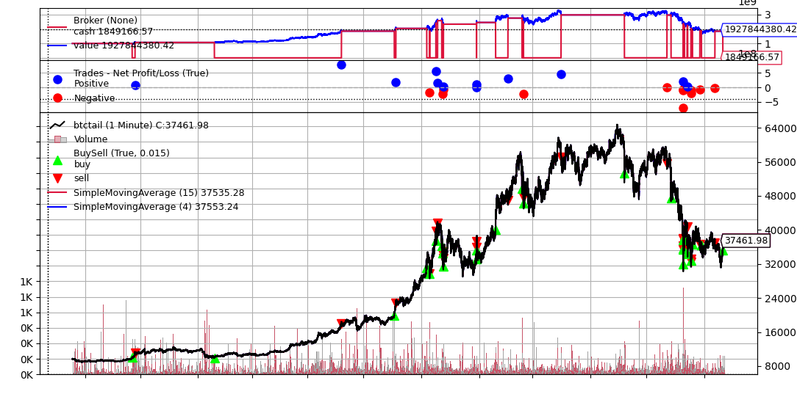

# Crypto Shorting Backtester

This project uses the `backtrader` library to backtest and optimize a cryptocurrency trading strategy based on moving averages and their slope.

## Strategy Overview

The core strategy ([`MyStrategy`](/Users/I752271/Documents/GitHub/crypto-shorting/shorting_run.py#L5)) implemented in this project utilizes two Simple Moving Averages (SMAs):

1.  A primary SMA (`sma`) with period `maperiod`.
2.  A secondary SMA (`slope_sma`) with period `slope_ma_period`, used to calculate the recent trend slope.

**Trading Logic:**

*   **Entry (Buy):** A long position is entered if the current closing price (`dataclose`) is above the primary SMA (`sma`) AND the calculated slope (`diff`) of the `slope_sma` over the `slope_ma_period` is greater than a defined threshold (`slope_diff`).
*   **Exit (Sell):** The position is closed if the closing price falls below the primary SMA (`sma`) AND the calculated slope (`diff`) is less than the negative of the `slope_diff` threshold.

## Files

*   [`shorting_run.py`](/Users/I752271/Documents/GitHub/crypto-shorting/shorting_run.py): Runs a single backtest of the strategy using predefined parameters and plots the results. It uses `btctail.csv` as input data.
*   [`crypto_shorting_opti.py`](/Users/I752271/Documents/GitHub/crypto-shorting/crypto_shorting_opti.py): Performs parameter optimization for the strategy by testing ranges for `maperiod`, `slope_ma_period`, and `slope_diff`. It uses `btcsideways.csv` as input data and prints the performance for each parameter combination.

## Dependencies

*   [Poetry](https://python-poetry.org/) for dependency management.
*   backtrader
*   numpy

Install Poetry following the [official documentation](https://python-poetry.org/docs/#installation).

Then, install project dependencies using Poetry:
```bash
poetry install
```

## Data

The scripts expect CSV data files (`btctail.csv`, [`btcsideways.csv`](btcsideways.csv )) in the same directory. The CSV format should be:

```
Timestamp, Open, High, Low, Close, Volume
YYYY-MM-DD HH:MM:SS, open_price, high_price, low_price, close_price, volume_value
```

The scripts are configured to read this format using [`backtrader.feeds.GenericCSVData`](crypto_shorting_opti.py ).

## Usage

1.  **Prepare Data:** Ensure you have the required CSV data files (`btctail.csv` for [`shorting_run.py`](shorting_run.py ), [`btcsideways.csv`](btcsideways.csv ) for [`crypto_shorting_opti.py`](crypto_shorting_opti.py )) in the project directory with the correct format.
2.  **Install Dependencies:**
    ```bash
    poetry install
    ```
3.  **Run Single Backtest:**
    ```bash
    poetry run python shorting_run.py
    ```
    This will output the final portfolio value and generate a plot showing trades and indicators.

## Example Result



## Parameters

The strategy uses the following parameters defined within the [`MyStrategy`](crypto_shorting_opti.py ) class:

*   [`maperiod`](crypto_shorting_opti.py ): The lookback period for the primary Simple Moving Average.
*   [`slope_ma_period`](crypto_shorting_opti.py ): The lookback period for the secondary Simple Moving Average used for slope calculation.
*   [`slope_diff`](crypto_shorting_opti.py ): The threshold for the calculated slope ([`diff`](crypto_shorting_opti.py )) to trigger buy/sell signals.

These parameters can be adjusted directly in `shorting_run.py` for single runs or defined as ranges in `crypto_shorting_opti.py` for optimization.